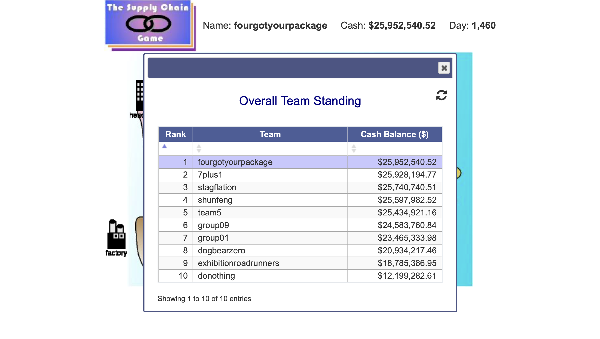
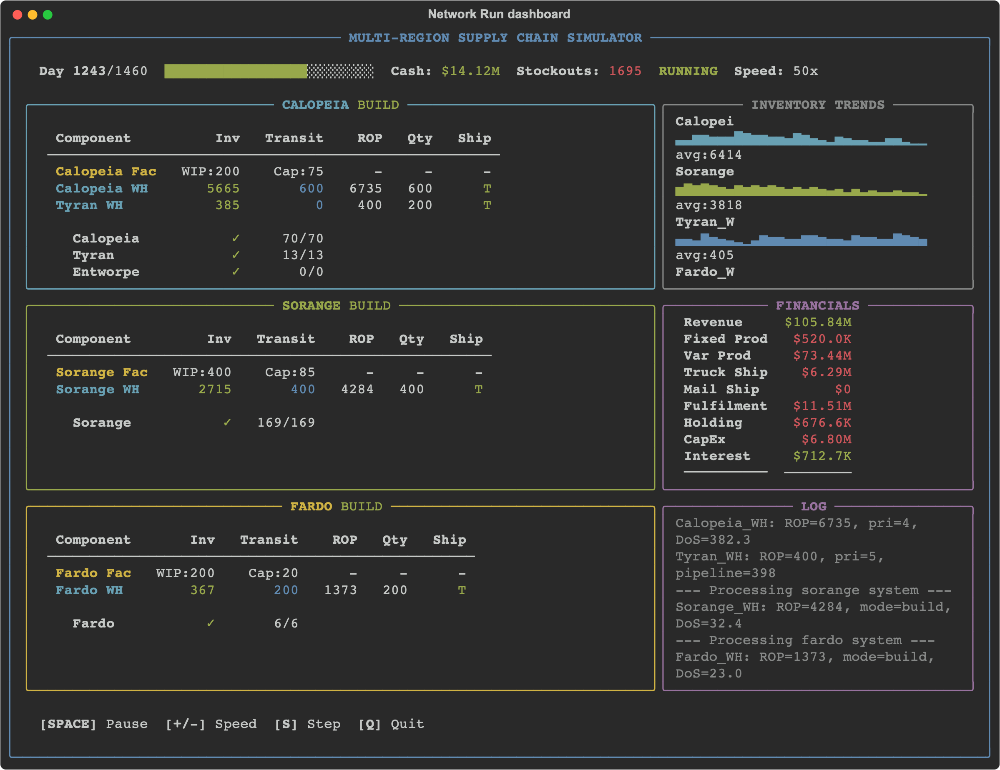
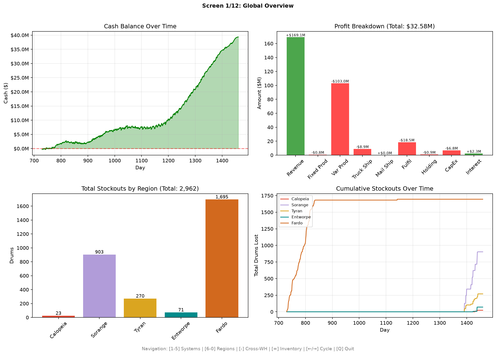
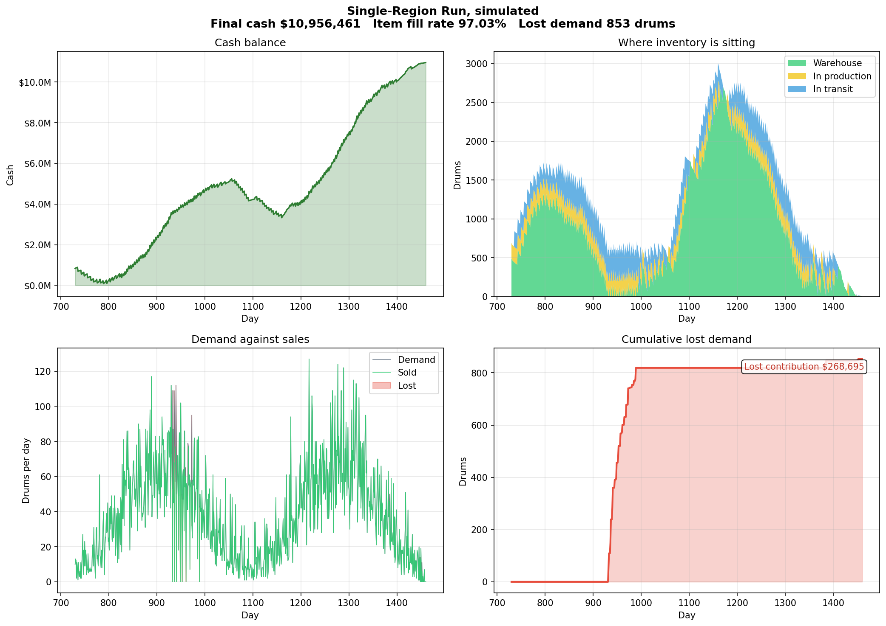

# Supply Chain Autopilot

Two autonomous bots that played the Imperial College Supply Chain Game, a competitive discrete-event simulation of a chemical drum supply chain running over a simulated four-year horizon. The bots scraped the game's web interface, forecast regional demand, sized production and inventory, and wrote the resulting settings back to the game once per simulated day, unattended, for the full length of each run.

**The Network Run finished first of ten teams with a closing cash balance of $25,952,540.**



---

## Results

The game was played in two assessed stages. Each is named consistently throughout this repository and its documentation.

The **Single-Region Run** covered one region, Calopeia, with one factory and one warehouse. The **Network Run** covered five regions across a continent and an island, with decisions over where to build factories and warehouses as well as how to operate them.

| | Single-Region Run | Network Run |
|---|---|---|
| Final cash | $12,375,000 | **$25,952,540** |
| Placing | Top three | **1st of 10** |
| Item fill rate | 93.87% | 96.88% |
| Total demand | 28,743 drums | 117,305 drums |
| Drums sold | 26,729 | 113,650 |
| Lost demand | 2,014 drums | 3,655 drums |
| Leftover inventory on the final day | 10 drums | 101 drums |
| Capital invested | $1,000,000 | $6,800,000 |

A team that made no decisions at all finished the Network Run on $12,199,282. The strategy in this repository more than doubled that.

Both runs were played by Group 4, "fourgotyourpackage", on the CIVE70108 Freight Transport and Logistics course. The strategy was designed by the whole team of eight. The bots, the simulators, and the deployment in this repository are my own work.

---

## The problem

The game gives a player four levers and punishes almost every intuition about how to use them.

Production capacity is bought outright at $50,000 per drum per day and takes 90 days to come online, so it must be committed to long before the demand it serves appears. Capacity can never be reduced. A batch of drums costs $2,000 to start plus $900 per drum, so small batches waste money. Shipping by truck costs a flat $15,000 for up to 200 drums and takes seven days, so any batch that is not a multiple of 200 wastes paid capacity. Shipping by mail arrives in one day but costs $150 per drum. An order that cannot be filled within one day is lost to a competitor rather than backordered.

The decisive number is the margin on a drum. Selling one drum within its own region, delivered by a full truck, earns:

```
1450 - 2000/200 - 900 - 15000/200 - 150 = $315
```

Holding a drum costs $90 per year, or about $0.25 per day. A drum can therefore sit in a warehouse for more than 1,200 days before its holding cost consumes the profit it would have made. Losing a sale costs the entire $315 immediately.

That asymmetry drives every decision both bots make. Carrying too much stock is cheap. Running out is expensive. Both strategies are built to err heavily towards surplus.

---

## Quick start

Neither bot can be run against the live game, because the game server closes at the end of each cohort's run. The simulators reproduce the game mechanics offline and are the runnable part of this repository. Both drive the identical strategy code that played the assessed runs.

```bash
pip install -r requirements.txt

# Network Run, with a live terminal dashboard
python -m scgame.simulator.network.run

# Network Run, no dashboard, for a result in about a minute
python -m scgame.simulator.network.run --headless

# Single-Region Run
python -m scgame.simulator.single_region.run
```

The Network Run dashboard shows all three production systems, regional demand and shortfalls, the running profit and loss, and the bot's own reasoning as it decides.



Closing the dashboard opens twelve analysis screens covering the network, each system, each region, shipping, cross-fulfilment, and total inventory.



---

## The Single-Region Run

Calopeia's demand is strongly seasonal on a 365-day cycle, peaking at roughly twice its annual mean of 39 drums per day. Capacity was set to 50 drums per day, slightly above the mean and well below the peak. Meeting the peak therefore depended entirely on stock accumulated during the trough.

Demand is forecast with Holt-Winters additive exponential smoothing, refitted daily on the full history. The additive form fits because Calopeia's seasonal swing is roughly constant in absolute drums rather than proportional to the level. Deseasonalising the series drops its coefficient of variation from 0.676 to 0.177, which confirms that most of the apparent volatility is predictable season rather than noise.

Each day the bot compares mean forecast demand over the next 14 days against capacity, and selects one of three operating modes.

| Mode | Entered when | Behaviour |
|---|---|---|
| **Build** | Capacity exceeds demand and a shortfall lies ahead | Raise the reorder point to the size of the coming shortfall, so production keeps triggering until the peak is covered |
| **Drawdown** | Demand exceeds capacity | Pin the reorder point above any reachable stock level, so the factory runs flat out while inventory drains |
| **Chase** | Neither of the above | Hold enough to cover the lead time plus safety stock |

The shortfall the Build mode targets is the sum of `max(0, forecast demand - capacity)` over the next 182 days, scaled by 1.3 to absorb forecast error. Half a year reaches the next peak from any point in the cycle, which a shorter horizon would miss entirely during the trough.

Safety stock is `z(0.999) x sigma x sqrt(lead time)`, doubled again. The doubling is not caution for its own sake. It follows from the $315 against $0.25 asymmetry above.

From day 1430 demand declines linearly to zero. The bot switches to mail, whose one-day delivery makes arrival dates predictable enough to aim at, and sizes each remaining order to leave nothing in the warehouse after day 1457. It finished the run holding 10 drums.



---

## The Network Run

Five regions behave differently enough that a single forecasting method suits none of them.

| Region | Demand pattern | Method |
|---|---|---|
| Calopeia | Seasonal, 365-day cycle | Read from the recorded series, which repeated the Single-Region Run exactly and was therefore known rather than predicted |
| Sorange | Growing linearly until day 1430 | Least-squares fit, `0.165 x (day - 730) + 14.2` |
| Tyran | Stable | Moving average from day 670 |
| Fardo | Stable | Moving average from day 670 |
| Entworpe | Occasional blocks of 250 drums, coefficient of variation 4.43 | Flat daily rate |

Entworpe is the instructive case. Its demand is so erratic that no daily model can time it, so the bot does not try, and no warehouse was built there at all.

### Network design

Return on investment was computed for every candidate facility over the 640 operating days that would remain after construction. The margin table below is what decided the layout.

| Supply arrangement | Margin per drum |
|---|---|
| Factory and warehouse in the same region | $315 |
| Factory shipping to a warehouse in another region | $290 |
| Warehouse serving a customer in another region | $265 |
| Mainland warehouse serving a customer on Fardo | $65 |

Serving the island from the mainland destroys 79% of the margin. Fardo was therefore given its own factory and warehouse and run as a closed system. Sorange, the highest-demand region, was given the same. Tyran received a warehouse but no factory, because local fulfilment saves $50 per drum while a factory could not repay itself. Entworpe received nothing and is served from Calopeia, accepting $265 per drum rather than paying $100,000 for a warehouse its demand could not justify.

The result is three systems that never exchange inventory, so a shortage in one can never starve another.

```
Calopeia system          Sorange system        Fardo system
Calopeia factory   -->   Sorange factory  -->  Fardo factory
  |          |             |                     |
  v          v             v                     v
Calopeia   Tyran        Sorange               Fardo
warehouse  warehouse    warehouse             warehouse
  |
  v
Entworpe customers, by cross-region fulfilment
```

### Always On

The Single-Region Run's three modes were dropped. In the Network Run the regional forecasts are too noisy for mode switching to be reliable, and a forecast error that pauses a factory costs more than the stock it saves.

Instead, every factory runs continuously. The reorder point is set to the current pipeline plus 1,000 drums, which the game can never satisfy, so production is always triggered. Production stops only when a direct comparison shows that stock already in hand covers all remaining demand:

```
reorder point = inventory + in transit + 1000
stop when     = inventory + in transit >= remaining demand to day 1450
```

Batch size is stepped up as the pipeline grows, from 200 drums to 400 and then 600, which spreads the $2,000 order charge across more drums. Every tier is a whole number of trucks.

One refinement handles the shared Calopeia factory. It feeds two warehouses, so Tyran is topped up to a floor of 400 drums and no further, and everything beyond that goes to Calopeia, where the seasonal peak makes a large buffer worth holding. Priority switches to Tyran only while it sits below its floor.

The Network Run achieved a 96.88% item fill rate, and almost every stockout it did suffer occurred before day 820, while the new factories were still being built.

---

## Architecture

Each bot is a decision loop that talks to a controller. The controller is either the live game or the simulator, and both expose the same interface, so the strategy code exercised offline is exactly the strategy code that played the assessed runs.

```
        SingleRegionBot                      NetworkBot
        scgame/single_region/bot.py          scgame/network/bot.py
               |                                    |
        +------+------+                      +------+------+
        |             |                      |             |
        v             v                      v             v
   Live game      Simulator             Live game      Simulator
   controller     controller            controller     controller
        |             |                      |             |
        +------+------+                      +------+------+
               |                                    |
               v                                    v
        calculator.py                        calculator.py
        Holt-Winters, three modes            Always On, three systems
               |                                    |
               +----------------+-------------------+
                                v
                      scgame/common/economics.py
                      One source of truth for every cost
```

Every cost figure used by either strategy, either simulator, and the written analysis comes from `scgame/common/economics.py`. That is deliberate. The two codebases previously carried separate copies of the cost constants and had already drifted apart.

### Layout

```
scgame/
  common/
    economics.py            Costs, margins, and the break-even calculation
    browser_controller.py   Shared Selenium navigation and table scraping
    discord_logger.py       Remote monitoring for the deployed bot
  single_region/            Single-Region Run: strategy, live controller, bot
  network/                  Network Run: strategy, topology, live controller, bot
  simulator/
    single_region/          Engine, demand, analysis, entry point
    network/                Engine, fulfilment, build schedule, dashboard, analysis
data/                       Recorded demand for every region and every day
docs/                       Coursework report, presentation, generated figures
deploy/                     EC2 provisioning script and systemd unit
tests/                      74 tests, no browser or network access required
```

---

## Running against the live game

Retained for completeness. The game server closes at the end of each cohort's run, so these paths cannot be re-executed.

```bash
export TEAM_ID="your_team_name"
export TEAM_PASSWORD="your_password"
export DISCORD_WEBHOOK_URL="https://discord.com/api/webhooks/..."   # optional

python -m scgame.single_region.bot
python -m scgame.network.bot
```

Credentials are read from the environment and are never stored in this repository. See `.env.example`.

The bot polls every five minutes, detects a change in the game day, and runs one decision cycle. Repeated failures are assumed to mean a dead browser session, so after three consecutive errors the session is destroyed and rebuilt, and the loop resumes. That recovery is what allowed the bot to run unattended for a week at a time.

Scraping the game is more involved than it looks. Every facility opens in its own popup window, and each data table renders only after a second button is pressed inside that popup. Facilities are addressed by region number taken from the map anchor's href rather than by icon image, because a facility under construction shows a different icon from an operational one while its region number does not change.

---

## Deployment

Both bots ran on an AWS EC2 instance under systemd for the duration of each game.

```bash
sudo ./deploy/setup_ec2.sh
sudo systemctl start supplychain-bot
sudo journalctl -u supplychain-bot -f
```

The service restarts on failure. Warnings and errors are forwarded to a Discord channel, so a stockout risk or a dead session was visible within minutes without anyone watching a terminal.

---

## Tests

```bash
pip install pytest
python -m pytest tests -q
```

74 tests, running in about a second, with no browser and no network access. They cover the cost model against the figures published in the coursework report, the timing and accounting rules the engines must obey, the boundaries of every mode transition, the endgame liquidation, the nearest-warehouse fulfilment policy, and the Always On production and shutdown rules.

Several exist specifically to pin down defects found while preparing this repository, including an engine that served demand before receiving that day's deliveries, and a capacity parser that failed whenever the game reported a whole number.

---

## Simulated against actual

The simulators reproduce the game's mechanics and replay the recorded demand, but they are idealised in one respect. The simulated bot acts on every single day, whereas the deployed bot polled every five minutes against a game running roughly one simulated day every twelve minutes, and occasionally lost a day to a browser restart. The simulators are accordingly a little optimistic on service.

| | Single-Region Run actual | Single-Region Run simulated | Network Run actual | Network Run simulated |
|---|---|---|---|---|
| Item fill rate | 93.87% | 97.03% | 96.88% | 97.52% |
| Leftover inventory | 10 drums | 5 drums | 101 drums | 316 drums |
| Capital invested | $1,000,000 | $1,000,000 | $6,800,000 | $6,800,000 |

The figures in the results table at the top of this page are the actual game results, taken from the game's own final standings and the coursework report. The simulator's own output is labelled as simulated wherever it appears.

---

## Documents

- [Coursework report](docs/coursework-report.pdf), including the demand analysis, the return-on-investment calculations, and the decision logs for both runs.
- [Presentation](docs/presentation.pdf), covering the strategy, the results, and what a third run would have done differently.

---

## Licence

GNU General Public License v3.0. See [LICENSE](LICENSE).

Copyright (C) 2026 Kilian Schwarz. This program is free software. You may redistribute it and modify it under the terms of the GPL as published by the Free Software Foundation, either version 3 of the licence or, at your option, any later version. It is distributed without any warranty, and without even the implied warranty of merchantability or fitness for a particular purpose.

The coursework report and presentation in `docs/` are academic work submitted for CIVE70108 at Imperial College London by all eight members of Group 4. They are not covered by the licence above and remain the property of their authors.
